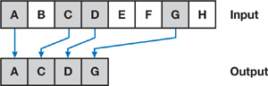
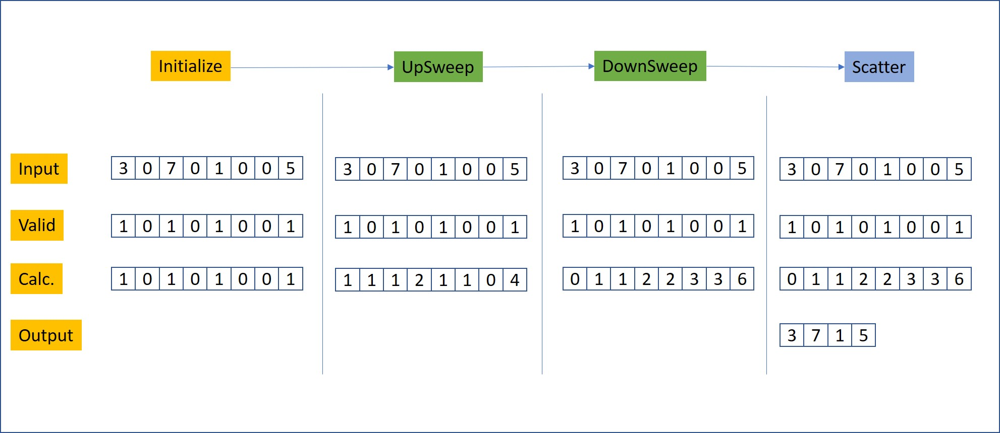

CUDA Stream Compaction
====================

**University of Pennsylvania, CIS 565: GPU Programming and Architecture**

**Anantha Srinivas**
[LinkedIn](https://www.linkedin.com/in/anantha-srinivas-00198958/), [Twitter](https://twitter.com/an2tha)

**Tested on:**
* Windows 10, i7-8700 @ 3.20GHz 16GB, GTX 1080 8097MB (Personal)
* Built for Visual Studio 2017 using the v140 toolkit

---

Introduction
---

Stream Compaction is a technique used to remove specific unwanted elements from a continous array of elements.

Given an input of elements and a list of removable items as shown in the above figure [1], we need to generate a new array of output that contains only the desired elements.

Stream compaction has many uses included optimizing ray collections in Path Tracers or compressing sparse matrices. Running Stream compaction on a CPU for a large number of elements ( > 2^8) might not be efficient. We will try to parallelize this algorithm to achieve a better peformance.

Implementation
---
Stream Compaction on the GPU can roughly be broken down into three steps.

1. `Initialization`
2. `Scan`
    1. `UpSweep`
    2. `DownSweep`
3. `Scatter`

Performance Analysis
---

Further questions
---

References
---

[1] - [GPU Gems Chapter 39](https://developer.nvidia.com/gpugems/GPUGems3/gpugems3_ch39.html)
