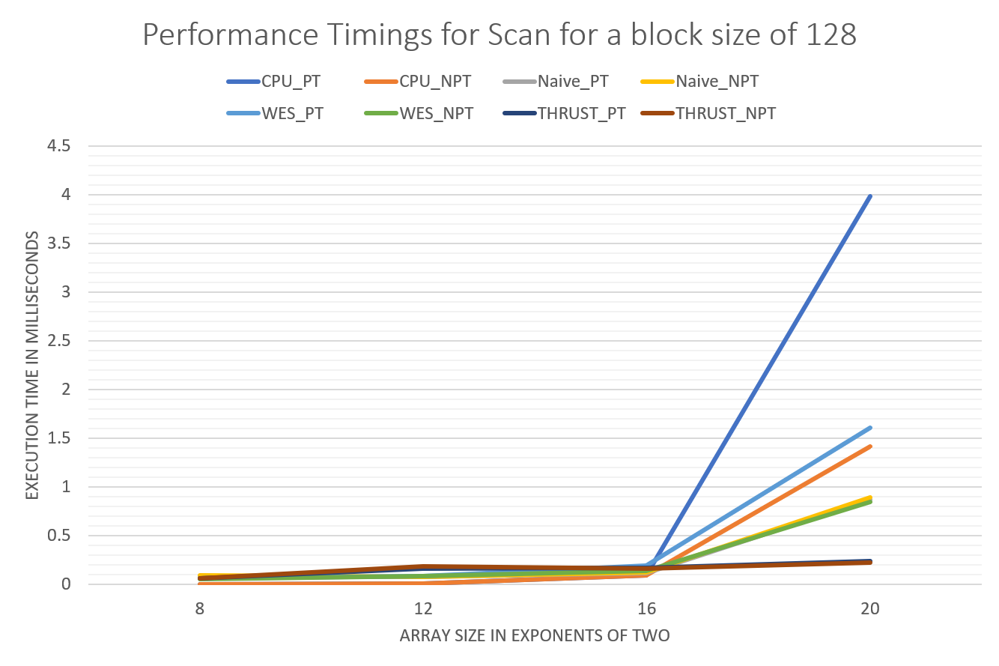
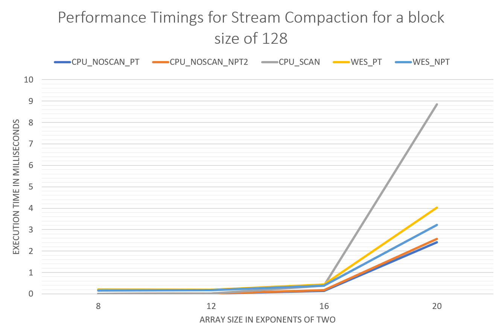

CUDA Stream Compaction
====================

**University of Pennsylvania, CIS 565: GPU Programming and Architecture**

**Anantha Srinivas**
[LinkedIn](https://www.linkedin.com/in/anantha-srinivas-00198958/), [Twitter](https://twitter.com/an2tha)

**Tested on:**
* Windows 10, i7-8700 @ 3.20GHz 16GB, GTX 1080 8097MB (Personal)
* Built for Visual Studio 2017 using the v140 toolkit

---

Introduction
---

Stream Compaction is a technique used to remove specific unwanted elements from a continous array of elements.


Given an input of elements and a list of removable items as shown in the above figure [1], we need to generate a new array of output that contains only the desired elements.

Stream compaction has many uses included optimizing ray collections in Path Tracers or compressing sparse matrices. Running Stream compaction on a CPU for a large number of elements ( > 2^8) might not be efficient. We will try to parallelize this algorithm to achieve a better peformance.

Implementation
---
Stream Compaction on the GPU can roughly be broken down into three steps.

1. `Initialization`
2. `Scan`
    1. `UpSweep` 
    2. `DownSweep`
3. `Scatter`

An example of the steps that occur in this algorithm.


Performance Analysis
---

Test Conditions:
* Windows 10, i7-8700 @ 3.20GHz 16GB, GTX 1080 8097MB (Personal)
* Running in Release mode.
* NVIDIA Vertical sync is turned off.

Overall I found that the performance of the various techniques and hardware to be in this order:

`Thrust < Work-efficient GPU scan < Naive GPU scan < CPU scan`

**However** for some test cases I found that my implementation of Work efficient GPU scan was performing way better than Thrust's implementation. The following is a table describing the timings run with the mentioned test conditions (and block size of 128).

|  | 2^8 |  2^12 | 2^16 | 2^20 | 2^24 |
| --- | --- | --- | --- | --- | --- |
|CPU Power of 2 | 0.000642ms| 0.005453ms| 0.090786ms| 3.98564ms| 62.7343ms| 
|CPU Non-Power of 2 | 0.00032ms| 0.005775ms| 0.088862ms| 1.41794ms| 22.8898ms| 
|Naive GPU Power of 2 | 0.086016ms| 0.074752ms| 0.118784ms| 0.867328ms| 16.2294ms| 
|Naive GPU Non-Power of 2 | 0.09216ms| 0.0768ms| 0.124928ms| 0.89088ms| 15.8597ms| 
|WE Scan Power of 2 | 0.057344ms | 0.08704ms| 0.18944ms| 1.60768ms| 25.089ms|
|WE Scan Non-Power of 2 | 0.0512ms| 0.082944ms| 0.139264m| 0.842752ms| 12.2982ms| 
|Thrust Power of 2 | 0.057344ms| 0.164864ms | 0.169984ms|  0.234496ms| 0.763904ms|
|Thrust Non-Power of 2 | 0.060416ms| 0.305152ms| 0.15872ms| 0.224256ms | 0.792576m|





Further timing data can be found under: `./results`

Further questions
---

I found that the thrust implementation was slower than mine for a block size of `128` and an array size of `2^8`. I think that this may be due to the fact that Thrust performs some sort of caching and optimizing for large array size. For a small array size this optimization may actually be an overhead.


Here is some results from the test cases.
Further data can be found under `./results`


For Block Size of 128
```
****************
** SCAN TESTS **
****************
ARRAY SIZE : 256
    [  35  36  45  46  43   2  36  26  41   5   1  22  33 ...  47   0 ]
==== cpu scan, power-of-two ====
   elapsed time: 0.000642ms    (std::chrono Measured)
==== cpu scan, non-power-of-two ====
   elapsed time: 0.000321ms    (std::chrono Measured)
    passed
==== naive scan, power-of-two ====
   elapsed time: 0.06656ms    (CUDA Measured)
    passed
==== naive scan, non-power-of-two ====
   elapsed time: 0.06656ms    (CUDA Measured)
    passed
==== work-efficient scan, power-of-two ====
   elapsed time: 0.058368ms    (CUDA Measured)
    passed
==== work-efficient scan, non-power-of-two ====
   elapsed time: 0.052224ms    (CUDA Measured)
    passed
==== thrust scan, power-of-two ====
   elapsed time: 0.058368ms    (CUDA Measured)
    passed
==== thrust scan, power-of-two ====
   elapsed time: 0.08704ms    (CUDA Measured)
    passed
==== thrust scan, non-power-of-two ====
   elapsed time: 0.055296ms    (CUDA Measured)
    passed

*****************************
** STREAM COMPACTION TESTS **
*****************************
    [   0   1   1   1   2   2   3   2   3   1   0   2   2 ...   3   0 ]
==== cpu compact without scan, power-of-two ====
   elapsed time: 0.000642ms    (std::chrono Measured)
    [   1   1   1   2   2   3   2   3   1   2   2   3   2 ...   3   3 ]
    passed
==== cpu compact without scan, non-power-of-two ====
   elapsed time: 0.000963ms    (std::chrono Measured)
    [   1   1   1   2   2   3   2   3   1   2   2   3   2 ...   2   3 ]
    passed
==== cpu compact with scan ====
   elapsed time: 0.001283ms    (std::chrono Measured)
    [   1   1   1   2   2   3   2   3   1   2   2   3   2 ...   3   3 ]
    passed
==== work-efficient compact, power-of-two ====
  0   1   1   1   2   2   3   2   3   1   0   2   2 ...   3   0 ]
   elapsed time: 0.191488ms    (CUDA Measured)
    passed
==== work-efficient compact, non-power-of-two ====
  0   1   1   1   2   2   3   2   3   1   0   2   2 ...   2   3 ]
   elapsed time: 0.14848ms    (CUDA Measured)
    passed
```


For Block Size of 512
```
****************
** SCAN TESTS **
****************
ARRAY SIZE : 16777216
    [  37   9  40  17  14  33  23   4  25  41  26  43  37 ...  14   0 ]
==== cpu scan, power-of-two ====
   elapsed time: 59.1057ms    (std::chrono Measured)
==== cpu scan, non-power-of-two ====
   elapsed time: 22.8725ms    (std::chrono Measured)
    passed
==== naive scan, power-of-two ====
   elapsed time: 16.3615ms    (CUDA Measured)
    passed
==== naive scan, non-power-of-two ====
   elapsed time: 15.8372ms    (CUDA Measured)
    passed
==== work-efficient scan, power-of-two ====
   elapsed time: 28.3566ms    (CUDA Measured)
    passed
==== work-efficient scan, non-power-of-two ====
   elapsed time: 12.8952ms    (CUDA Measured)
    passed
==== thrust scan, power-of-two ====
   elapsed time: 0.88576ms    (CUDA Measured)
    passed
==== thrust scan, power-of-two ====
   elapsed time: 0.794624ms    (CUDA Measured)
    passed
==== thrust scan, non-power-of-two ====
   elapsed time: 0.828416ms    (CUDA Measured)
    passed

*****************************
** STREAM COMPACTION TESTS **
*****************************
    [   2   2   3   1   3   3   2   1   3   1   0   3   2 ...   1   0 ]
==== cpu compact without scan, power-of-two ====
   elapsed time: 34.9035ms    (std::chrono Measured)
    [   2   2   3   1   3   3   2   1   3   1   3   2   1 ...   2   1 ]
    passed
==== cpu compact without scan, non-power-of-two ====
   elapsed time: 34.8583ms    (std::chrono Measured)
    [   2   2   3   1   3   3   2   1   3   1   3   2   1 ...   2   2 ]
    passed
==== cpu compact with scan ====
   elapsed time: 134.979ms    (std::chrono Measured)
    [   2   2   3   1   3   3   2   1   3   1   3   2   1 ...   2   1 ]
    passed
==== work-efficient compact, power-of-two ====
  2   2   3   1   3   3   2   1   3   1   0   3   2 ...   1   0 ]
   elapsed time: 59.0572ms    (CUDA Measured)
    passed
==== work-efficient compact, non-power-of-two ====
  2   2   3   1   3   3   2   1   3   1   0   3   2 ...   0   2 ]
   elapsed time: 45.6591ms    (CUDA Measured)
    passed
```


References
---

[1] - [GPU Gems Chapter 39](https://developer.nvidia.com/gpugems/GPUGems3/gpugems3_ch39.html)
